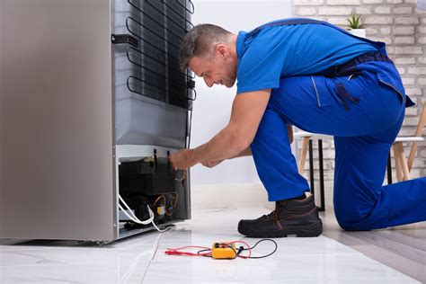
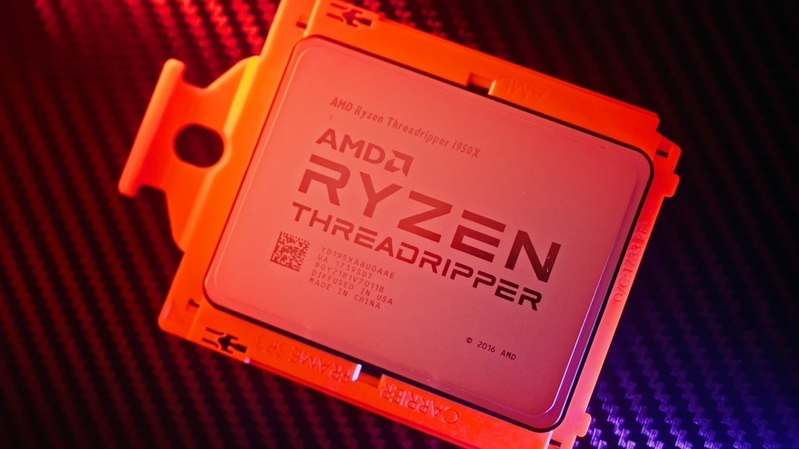
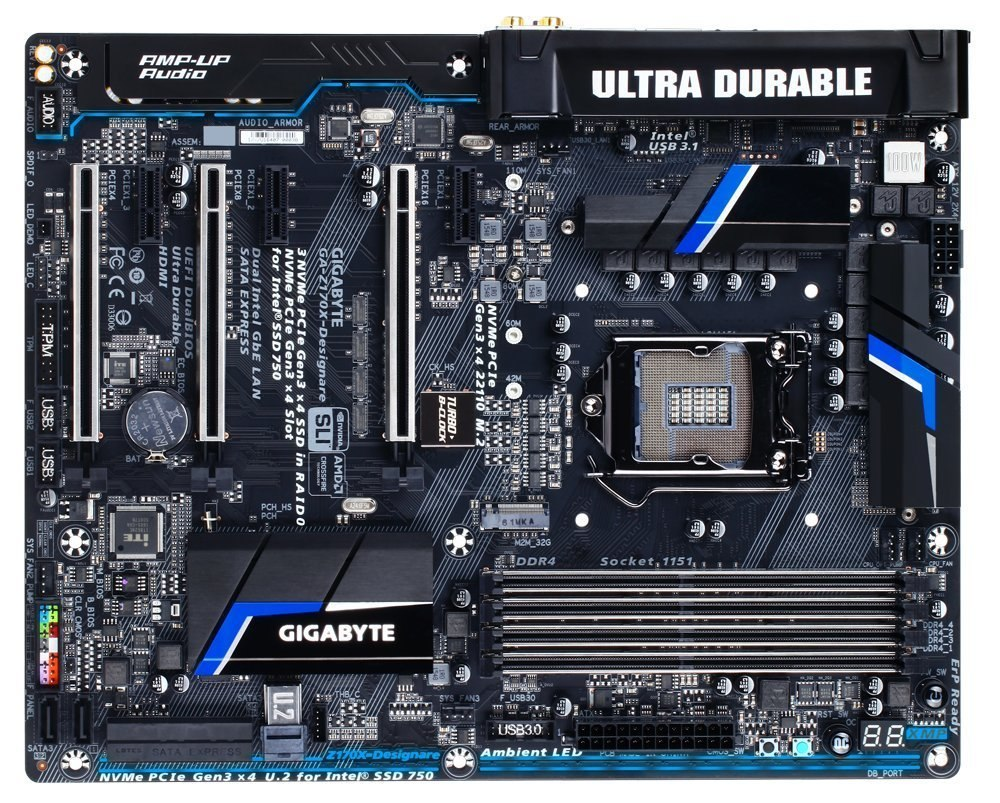
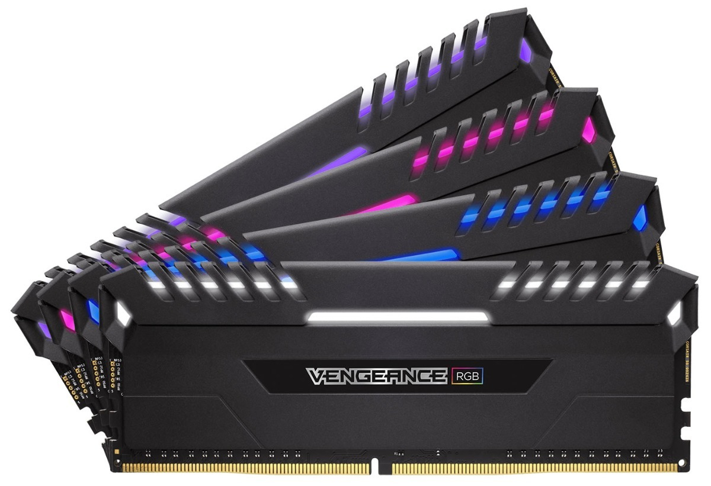
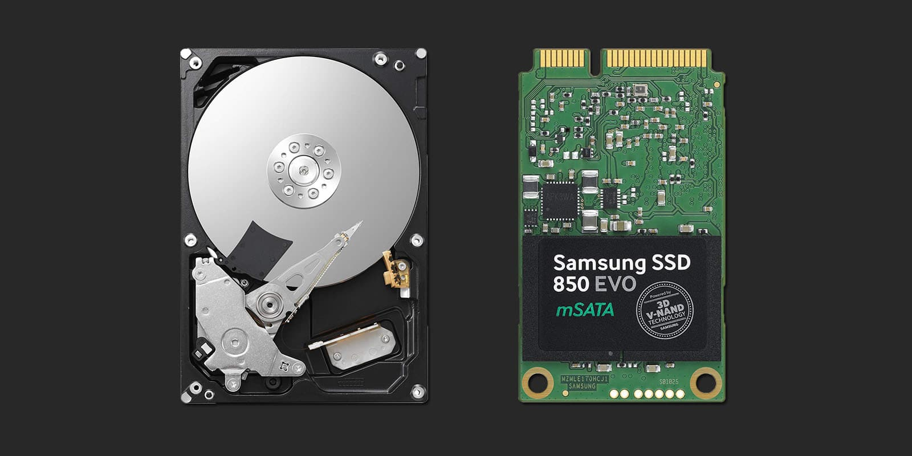
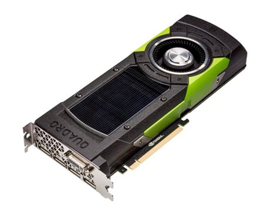
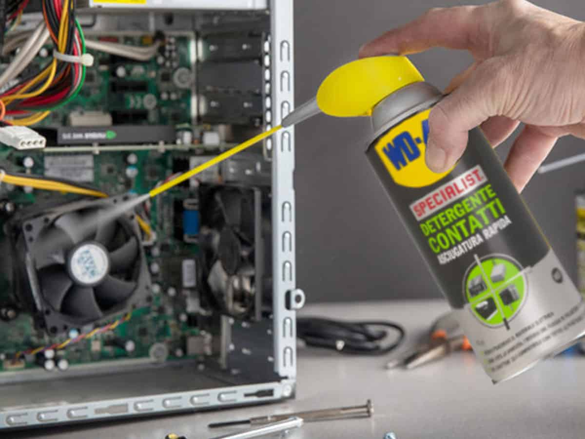
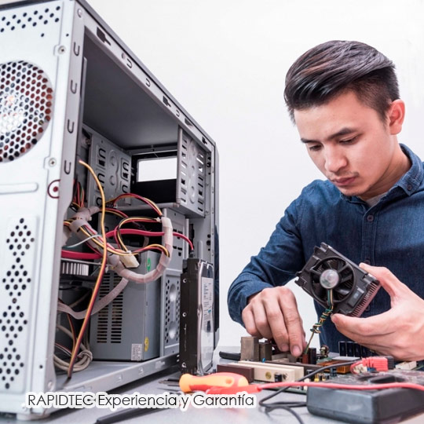
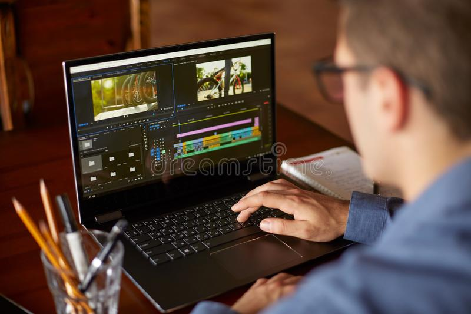
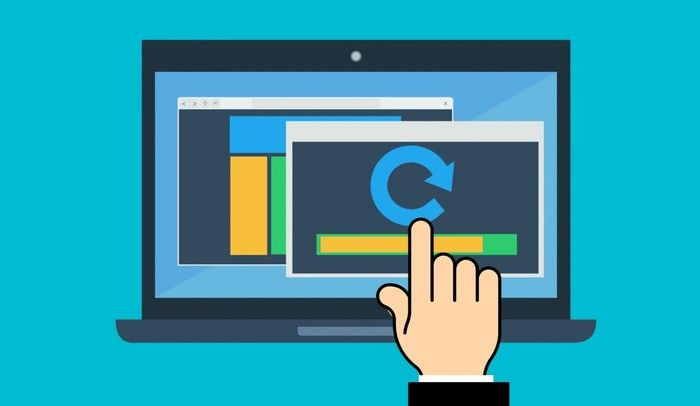

---
title:
- Penguin
author:
- Krapp Ramiro
theme:
- AnnArbor
date:
- 11 de Noviembre de 2021 

---

# Descripción de la empresa
## ¿Qúe es penguin?
Penguin es una empresa de soluciones informáticas, dedicada a solucionar 
problemas que surgen en empresas debido a una falta de organización en el
area informática.

## ¿Qué tareas desempeña? 
Penguin desempeña tareas centradas en su gran mayoría alrededor del ámbito
informático y profesional.

Las tareas más destacables son las siguientes:

- Documentación de equipos en una base de datos

- Reparación y mantenimiento de equipos

- Instalación y optimización de sistemas operativos

- Asesoramiento informático

---

# Justificación del proyecto
Hoy en día es fundamental tener una computadora que funcione de forma
correcta para desarrollar multiples actividades, tanto recreativas,
como de estudio y de trabajo.
Sabiendo eso, muchas veces surgen una gran cantidad de inconvenientes, 
como por ejemplo:

- Averío de computadora por mal uso o por malos hábitos.

- Desgaste de los equipos, sus componentes y su capacidad
de refrigeración por el paso del tiempo.

- Desconocimiento ante capacidad de hacer un trabajo de forma 
más eficiente y/o más organizada.

Ante la necesidad de solucionar todos estos inconvenientes, nace Penguin,
una empresa especialiazada en estos casos, con una gran capacidad para 
manejar distintas situaciones de forma excepcional, lo cual permite a 
los clientes aprovechar los recursos informáticos de forma eficiente.  

# Objetivos del proyecto
## Objetivo General
Mantenimiento y mejora de equipos informáticos, aprovechando los
recursos existentes que una organización pueda poseer sin
incurrir en gastos innecesarios

{width=50%}

---

## Documentación de los equipos en una base de datos
- Sus especificaciones técnicas.

- El estado actual de los componentes

- Los problemas que tenga en el momento de la revisión.

- Los tratamientos correspondientes que se apliquen.

## Mantenimiento de los equipos de refrigeración
- Cambio de pasta térmica y thermal pads.

- Limpieza de coolers y optimización del flujo de aire.

## Reparación de equipos en mal estado
- Equipos que no prendan o no den señal.

- Equipos cuyo dispositivo de almaceamiento este gastado o defectuoso.

- Otros defectos.

---

## Instalación y optimización de sistemas operativos
- Instalación y optimización de sistemas Microsoft Windows.

- Instalación y optimización de sistemas GNU/Linux.

- Optimización por software

## Asesoramiento informático
- ¿Cómo evitar ser infectado por un virus informático?

- ¿Cómo mantener los documentos ordenados?

- ¿Cómo trabajar más eficientemente?

- ¿Cómo solucionar problemas de forma autónoma?

- Malas prácticas, cómo dañan a los equipos que usamos y cómo evitarlas.

# Explicación en profundidad
En la base de datos, se diagraman los siguientes items

## CPU
 - Modelo

 - frecuencia

 - cantidad de núcleos

 - socket

{width=50%}

---

## Motherboard
 - Modelo

 - socket del CPU

 - DDR de la RAM

 - RAM máxima permitida

 - Frecuencia máxima de la RAM

{width=50%}

---

## RAM
 - Modelo

 - Capacidad

 - Frecuencia

 - DDR

 - Cantidad de slots ocupados

{width=50%}

---

## Almacenamiento
 - Modelo

 - ¿SSD o HDD?

 - En caso de HDD, velocidad de giro de los platos rotantes del disco

 - Cantidad de almacenamiento en GB

{width=50% }

---

## Gráficos
 - ¿Integrados o dedicados?

 - Modelo

 - Capacidad de memoria

 - Frecuencia de la memoria

{width=50% }

---

## Mantenimiento a la refrigeración
Este consiste en:

- Limpieza del polvo acumulado en el chasis

- Limpieza del polvo acumulado en los chasis FAN

- Limpieza del polvo acumulado en los CPU FAN

- Limpieza del polvo acumulado en los PCB

- Cambio de pasta térmica y thermal pads en los circuitos que lo requieran

- Des-ensamblaje de la fuente de alimentación para su limpieza

{width=50% }

---

## Reparar los equipos en mal estado
En caso de encontrar un equipo en mal estado, se procede a lo siguiente:

- Diagnóstico del error

- Si el error es de hardware, se reemplaza el equipamiento dañado

- Si el error es de software, se arregla el error

{width=50% }

---

## Instalar sistemas operativos y realizar optimización por Software
### En PCs con Microsoft Windows 10, se procede a
- Desactivar servicios innecesarios

- Desactivar telemetría

- Desactivar la instalación automática de actualizaciones opcionales que puedan

- causar inestabilidad en el equipo

- Desactivar las animaciones y la reducir la carga gráfica del escritorio

- Desinstalar el software basura con el que viene pre-instalado el sistema operativo

- En caso de tener una instalación SSD+HDD, mover las carpetas de Descargas, Fotos, 
Documentos, Musica y video a una partición en el HDD

---

### En PCs con GNU/Linux, se procede a
- Desactivar el login del firewall (por ejemplo, `ufw` )

- Cambiar a un compositor más ligero o desactivarlo para equipos de bajo rendimiento

- Bajar el nivel de swappiness a un nivel más adecuado

- En caso de que sea necesario, cambiar a un desktop enviroment más ligero para reducir la carga
sobre el CPU y la GPU

- En caso de tener una instalación SSD+HDD, montar la partición `/home` sobre el HDD

- Dependiendo de la cantidad de RAM, se pueden considerar los siguientes aspectos:

	- En caso de que la RAM sea mayor a 8GB: Montar `/tmp` sobre una partición `tmpfs`

	- En caso de que la RAM sea mayor a 6GB: Reducir el inode cache de forma menos agresiva
	modificando `sysctl.conf`

- En caso de que la RAM sea menor a 4GB: Incrementar `zswap`

---

## Asesorar informaticamente sobre los siguientes temas
### Virus informáticos
- ¿Qué es un virus informático?

- ¿Cómo se transmite?

- ¿Cómo se evitan?

- Como compartir y recibir documentos evitando infecciones

### Organización de documentos
- ¿Cómo asignar nombres de forma correcta?

- ¿Cómo ordenar las carpetas de manera idónea?

- ¿Cómo mantener un historial de las versiones de un documento?

- ¿Cómo mantener un escritorio prolijo?

---

### Trabajo de forma eficiente
- ¿Cómo hacer documentos y presentaciones de forma eficiente con LATEX y markdown?

- Los atajos de teclado y cómo ayudan a trabajar de forma rápida

{width=20% }

### Solución de problemas de forma autónoma
- ¿Cómo buscar cosas en internet filtrando resultados?

- Codigos de error y cómo buscarlos en internet

### Malas prácticas
- Cómo mantener una buena ventilación en los equipos

- Como evitar dañar los equipos

# Alcance del proyecto

## El proyecto en general no incluye
- La instalación eléctrica, de gas y de agua

## Mantenimiento de los equipos de refrigeración
### Incluye
- Limpieza de chasis FAN y de CPU FAN

- Limpieza de fuente de alimentación

- Cambio de pasta térmica y hermal pads

- Limpieza superficial de PCB’s

- Limpieza superficial del chasis

- Limpieza de las pantallas

### No incluye
- Limpieza del lugar de trabajo

---

## Reparación de los equipos
### Incluye
- Reparación por desperfecto técnico de fabricación

- Reparación por el mal uso de los equipos

## Instalación y optimización de los sistemas operativos
### Incluye
- Instalación de Windows 10 LSTC

- Debloatting de sistemas Micrsoft

- Instalación de sistemas GNU/Linux basados en Debian, Red Hat o Arch

- Optimización de sistemas GNU/Linux basados en Debian, Red hat o Arch

---

### No incluye
Instalación y optimización de los siguientes sistemas:
- Microsoft Windows XP / Vista / 7 / 8 / 8.1

- GNU/Hurd

- Sistemas GNU/Linux sin systemd como Artix

- Sistemas GNU/Linux con gráficos integrados SiS

- Sistemas GNU/Linux no basados en Debian, Red Hat o Arch como:

	- Slackware

	- NixOS

	- Void
	
	- Alpine
	
	- Gentoo
	
	- OpenSUSE
	
	- Deepin

{width=30% }

---

## Asesoramiento informático
### Incluye
- Capacitación sobre la protección contra software malicioso, páginas web maliciosas y como evitar caer en pishing

- Capacitación sobre los buenos hábitos a la hora de mantener documentos informáticos bien ordenados, organizados y categorizados

- Capacitación sobre backups y precaución ante la posible pérdida de datos

- Capacitación sobre cómo trabajar de forma más eficiente y profesional

- Capacitación sobre como solucionar los problemas de forma autónoma y sin la necesidad de requerir a un técnico

- Capacitación sobre como mantener un equipo para evitar desperfectos y lograr que mantenga un correcto funcionamiento a lo largo del tiempo

---

### No incluye
- Capacitación sobre lenguajes de programación

- Cuestiones ajenas a la informática

{width=70% }

# ¿Cuándo se realizarán las tareas?
Las tareas se comenzarán a realizar pasada una semana desde la firma del contrato como máximo,
y su finalización dependerá de los servicios contratados.

{width=70% }

# ¿Qué recursos son necesarios para realizarla?
## Para la base de datos se necesita

- Una computadora capaz de manejar el tamaño de la base de datos

## Tanto para la reparación como para el mantenimiento se necesita, por persona:
- 1 juego de destornilladores

- 1 pinza y alicate

- 1 aplicación de pasta térmica

- Thermal pads de múltiples tamaños y grosores

- 1 cepillo antiestática

- Multiples precintos

- En caso de que haya componentes averiados o malfuncionantes, su correspondiente reemplazo

---

## Para la instalación y optimización, se necesita
- 1 pendrive booteable (preferiblemente con Ventoy y múltiples ISO’s) 3.0 de 64GB

- 1 juego de mouse, teclado y parlantes

- 1 pantalla

- Scripts necesarios para las optimizaciones

{width=50%}

# ¿Quién es responsable del cumplimiento de la tarea?
- Reparación, instalación y mantenimiento — Los técnicos de Penguin

- Documentación y base de datos — El equipo de Base de datos de Penguin

- Asesoramiento informático — El equipo dedicado a asesoramiento de Penguin

{width=50% }

# ¿Cuándo deben estar completas?
- Deben estar completas segun lo estipulado en el contrato.

{width=70% }

# ¿Qué resultado se espera de la tarea?
Se espera un sencillo resultado, tener un equipo informático robusto y potente, bien organizado y
acorde con los estándares de hoy en día 

{width=80% }

# Prepuesto y costos
El precio de una contratación de Penguin varía segun los servicios contratados.

En una PyMe de 10 equipos y 10 personas, contratando todos los servicios, 
el presupuesto sería el siguiente:

## Coste inicial
- Armado de base de datos: $37995

- Mantenimiento de la refrigeracion: $8499

- Reparación de equipos en mal estado: $8499 + repuestos

- Instalación y mantenimiento de sistemas operativos:
	- Windows: $10199
	- Linux: $8499
- Asesoramiento Informático: $19899

## Coste mensual
- Mantenimiento de base de datos: $4999

# Gestión de Proyectos
Para el armado de base de datos, el mantenimiento de la refrigeración, la reparación de equipos, y
la instalación y mantenimiento de SO, se necesita armar un inventario de las computadoras que hay.
Esto deberá ser entregado 2 semanas después de empezado el proyecto

{width=60% }

---

# Integración de pruebas
## Pruebas internas
### Base de datos
Se testea el correcto funcionamiento de la misma, de el ingreso y egreso de datos y de su
estabilidad
Su finalización dependerá de la cantidad de equipos

### Mantenimiento de la refrigeración
Se testea la correcta ventilación del equipo bajo carga
Su finalización dependerá de la cantidad de equipos

### Reparación de equipos
Se testea el correcto funcionamiento del equipo en todas sus funcionalidades y puertos
Su finalización dependerá de la cantidad de equipos

---

### Instalación y mantenimiento de S.O.
Se verifica que estén todos los S.O. instalados con su correcta optimización Su finalización
dependerá de la cantidad de equipos

### Asesoramiento informático
Se hace un examen para verificar el conocimiento de los temas dados Esto se realizará 3 meses
después de empezado el proyecto

{width=60% }

# Restricciones del proyecto
## Riesgo
Cosas que pueden salir mal:

1. Cortes de suministro eléctrico
En caso de corte de suministro eléctrico, todos los trabajos que necesiten de electricidad no van
a poder ser realizadas, y no va a quedar otra opción que esperar a que vuelva el suministro.

2. Fallecimiento de personal de Penguin
En ese caso, se seguirá trabajando

3. Desastres naturales
En ese caso, se seguirá trabajando hasta que estén las condiciones dadas, y el inventario de
equipos puede sufrir un cambio.

4. Averiación involuntaria de equipos
En este caso, se reintegrará un 50 % del coste original del producto

---

## Recursos
Se requiere un equipo de técnicos propio de Penguin, una instalación eléctrica acorde, y un espacio
humanamente usable para poder trabajar.

### Calidad
Se espera la máxima calidad que sea posible brindar con el presupuesto dado

### Alcance
Se espera tener un equipo informático robusto y potente, bien organizado y acorde con 
los estándares de hoy en día

---

### Tiempo
Dependerá de los servicios contratados, en nuestro ejemplo de 10 computadoras el
mismo será de entre 4 y 5 semanas.

### Coste
El coste para el usuario será de aproximadamente $94000 en el caso de contratar todos los servicios para
10 computadoras.

- Para penguin se calcula $130000 para el edificio, incluyendo el pago mensual de alquiler,
impuestos, agua, luz, gas y limpieza. El restante va a un pozo para posibles reparaciones

- Por cada técnico, se calcula $30000 por mes, calculado para un total de $480000 mensual para
16 técnicos. 

- Por cada Ingeniero en sistemas, se calculan $80000, para un total de $160000 mensual por
2 ingenieros.

- Por cada Profesor se calculan $32500 por més, para un total de $130000 mensuales por 4 profesores.

----

{width=80% }

# Gantt
A continuación, mostraré la diagramación segun Gantt
